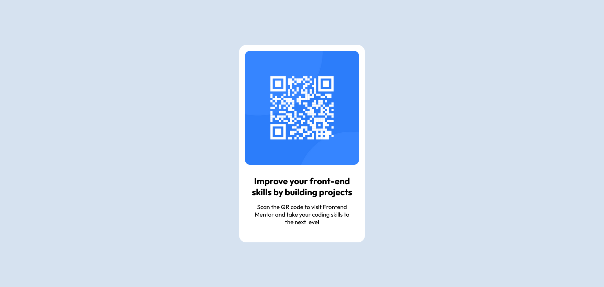

This is a solution to the [QR code component challenge on Frontend Mentor](https://www.frontendmentor.io/challenges/qr-code-component-iux_sIO_H). Frontend Mentor challenges help you improve your coding skills by building realistic projects. 

## Table of contents

- [Overview](#overview)
  - [Screenshot](#screenshot)
  - [Links](#links)
- [My process](#my-process)
  - [Built with](#built-with)
  - [Continued development](#continued-development)
- [Author](#author)

## Overview

### Screenshot

### Links

- Solution URL: (https://github.com/Dales10/Projetos/tree/main/treinamento/qr-code-component-main)
- Live Site URL: (https://dales10.github.io/Projetos/treinamento/qr-code-component-main/index.html)

## My process

### Built with

- Semantic HTML5 markup
- CSS custom properties
- Flexbox

### Continued development
Improve my vision to create projects more faithful to past design.

## Author

- GitHub - [Dário Matias (Dales)](https://github.com/Dales10)
- Twitter - [Dário Matias (Dales)](https://twitter.com/Dales_Adelta)
- Instagram - [Dário Matias](https://www.instagram.com/dario_delta10/)
